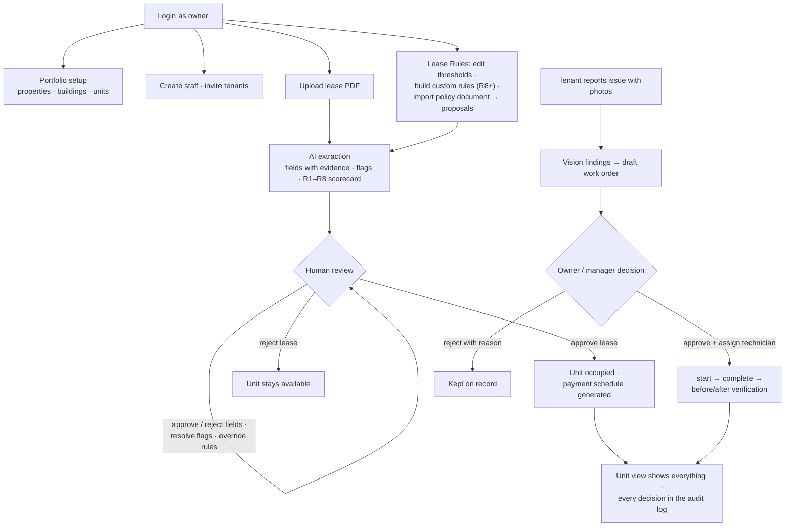

# Owner Workflow — Sridhar Property Intelligence

> **Role:** `owner`
> **Access Level:** Super Admin — unrestricted access to all endpoints
> **Auth:** `POST /api/v1/users/login/` → Bearer token



---

## 1. Portfolio Setup

### Create Ownership Entity
```http
POST /api/v1/ownership-entities/
{
  "name": "ABC Holdings Pvt Ltd"
}
```

### Create Property
```http
POST /api/v1/properties/
{
  "external_property_id": "PROP-001",
  "ownership_entity": 1,
  "name": "Skyline Residences",
  "location": "Lusail Marina District, Doha"
}
```

### Create Building
```http
POST /api/v1/buildings/
{
  "external_building_id": "BLDG-A",
  "property": 1,
  "name": "Tower A"
}
```

### Create Unit
```http
POST /api/v1/units/
{
  "external_unit_id": "MC-A-0301",
  "building": 1,
  "label": "Unit 301",
  "unit_type": "apartment",
  "bedrooms": 2,
  "bathrooms": 2,
  "area_sqm": "95.50",
  "floor_number": 3,
  "parking_bay": "P-12"
}
```

### Manage Units
| Action | Endpoint |
|--------|----------|
| List all units | `GET /api/v1/units/` |
| Update unit | `PATCH /api/v1/units/{id}/` |
| Archive unit | `POST /api/v1/units/{id}/archive/` |
| Unarchive unit | `POST /api/v1/units/{id}/unarchive/` |
| Full unit overview | `GET /api/v1/units/{id}/overview/` |
| Delete unit (no active lease) | `DELETE /api/v1/units/{id}/` |

---

## 2. Staff Management (Owner-Only)

### Create Property Manager
```http
POST /api/v1/users/staff/create/
{
  "email": "manager@company.com",
  "password": "SecurePass123",
  "first_name": "Sarah",
  "last_name": "Ahmed",
  "phone": "+974501234567",
  "role": "property_manager"
}
```

### Create Maintenance Staff
```http
POST /api/v1/users/staff/create/
{
  "email": "tech@company.com",
  "password": "SecurePass123",
  "first_name": "Ravi",
  "last_name": "Kumar",
  "phone": "+974509876543",
  "role": "maintenance_staff"
}
```

### Manage Staff
| Action | Endpoint |
|--------|----------|
| List all staff | `GET /api/v1/users/staff/` |
| List by role | `GET /api/v1/users/staff/?role=property_manager` |
| Update role / phone | `PATCH /api/v1/users/staff/{id}/` |
| Deactivate staff | `DELETE /api/v1/users/staff/{id}/` |

---

## 3. Tenant Management

### Create Tenant (direct)
```http
POST /api/v1/users/tenants/create/
{
  "email": "tenant@email.com",
  "password": "TenantPass123",
  "first_name": "Ali",
  "last_name": "Hassan",
  "phone": "+974501112222",
  "unit": 1,
  "move_in_date": "2026-01-01"
}
```

### Send Invitation Link
```http
POST /api/v1/users/invitations/
{
  "unit": 1,
  "email": "newtenant@email.com",
  "first_name": "Priya",
  "last_name": "Nair",
  "move_in_date": "2026-02-01"
}
```

### Manage Tenants
| Action | Endpoint |
|--------|----------|
| List active tenants | `GET /api/v1/users/tenants/` |
| List assignments | `GET /api/v1/users/assignments/` |
| End assignment (move-out) | `POST /api/v1/users/assignments/{id}/end/` |
| List invitations | `GET /api/v1/users/invitations/` |
| Revoke invitation | `POST /api/v1/users/invitations/{id}/revoke/` |

---

## 4. Lease Processing (AI-Powered)

### Step 1 — Upload PDF
```http
POST /api/v1/leases/upload/
Content-Type: multipart/form-data
document: <lease.pdf>
```

### Step 2 — Trigger AI Extraction (Ollama llama3.2)
```http
POST /api/v1/leases/{id}/process/
```
AI auto-extracts: tenant name, landlord name, unit ID, start/end dates, rent, deposit, currency, escalation clause, renewal terms, signatures.

### Step 3 — Review Extracted Fields
```http
GET /api/v1/leases/{id}/fields/
```

**Approve a field:**
```http
POST /api/v1/lease-fields/{id}/approve/
{ "reviewed_by": "owner@company.com", "reviewed_value": "2026-01-01" }
```

**Reject a field:**
```http
POST /api/v1/lease-fields/{id}/reject/
{ "reviewed_by": "owner@company.com", "reason": "Date appears incorrect" }
```

**Bulk approve all pending fields:**
```http
POST /api/v1/lease-fields/bulk-approve/
{ "ids": [1, 2, 3, 4, 5], "reviewed_by": "owner@company.com" }
```

### Step 4 — Review AI Flags
```http
GET /api/v1/leases/{id}/flags/
POST /api/v1/lease-flags/{id}/review/
{ "action": "resolve", "reviewed_by": "owner@company.com", "reviewer_comment": "Verified with tenant" }
```
Actions: `acknowledge` | `resolve` | `dismiss`

### Step 5 — Review Clauses
```http
GET /api/v1/leases/{id}/clauses/
POST /api/v1/lease-clauses/{id}/review/
{ "review_status": "approved", "reviewed_by": "owner@company.com" }
```

**Manually add a clause:**
```http
POST /api/v1/lease-clauses/
{
  "lease": 1,
  "clause_type": "pet_policy",
  "title": "No Pets Allowed",
  "raw_text": "Tenant shall not keep pets...",
  "is_unusual": false
}
```

### Step 6 — Check Validation Rules
```http
GET /api/v1/leases/{id}/validations/
```
Every rule returns `result` = `PASS` / `FAIL` / `UNDETERMINED` with a `reason` and a `severity` (`high`/`medium`/`low`). `UNDETERMINED` means the document didn't contain enough data — a human must decide; nothing is guessed.

| Rule | Check | Severity |
|------|-------|----------|
| R1 | Security deposit ≥ `min_deposit_months` × rent (default 1) | high |
| R2 | Rent escalation clause is specific | medium |
| R3 | Lease term ≤ `max_term_months` (default 36) | medium |
| R4 | End date > start date | high |
| R5 | Both parties identified and signed | high |
| R6 | Annual rent = monthly × 12 (± `tolerance_pct`) | low |
| R7 | Unit exists and is available | high |
| R8+ | Owner-created custom rules (see §5) | per rule |

**Override a failed rule** (decision is recorded in the audit log, reason required):
```http
POST /api/v1/validations/{id}/override/
{ "reason": "Owner accepts lower deposit — guarantor provided." }

POST /api/v1/validations/{id}/clear-override/
```

**Re-validate a lease** (re-runs the current rules on the already-extracted fields; no AI call):
```http
POST /api/v1/leases/{id}/revalidate/
```

### Step 7 — Approve or Reject Lease
```http
POST /api/v1/leases/{id}/approve/
{ "approved_by": "owner@company.com" }

POST /api/v1/leases/{id}/reject/
{ "rejected_by": "owner@company.com", "reason": "Missing signature" }
```

### Step 8 — Manual Corrections
```http
PATCH /api/v1/leases/{id}/
{
  "rent_amount": "5500.00",
  "start_date": "2026-01-01",
  "end_date": "2026-12-31"
}
```

### Cancel a Lease (soft delete)
```http
POST /api/v1/leases/{id}/cancel/
{ "cancel_reason": "Tenant withdrew before move-in", "cancelled_by": "owner@company.com" }
```

---

## 5. Lease Rules (Owner-Configurable)

The owner's acceptance standards live in `sample_data/owner_ruleset.json` and are editable from the portal (**Lease Rules** page) or the API. Only the `owner` role can change rules; managers can view. Every change is audit-logged.

### View / edit the built-in rules (R1–R7)
```http
GET /api/v1/lease-rules/

PATCH /api/v1/lease-rules/R3/
{ "severity": "high", "enabled": true, "config": { "max_term_months": 48 } }
```
Editable per rule: `description`, `severity`, `enabled`, and the numeric thresholds in `config`
(R1 `min_deposit_months`, R3 `max_term_months`, R6 `tolerance_pct`). The check **logic** is not editable — user input is never executed as code.

### Create your own rules (R8, R9, …) from templates
```http
GET /api/v1/custom-rules/options/     # dropdown choices for the rule builder

POST /api/v1/custom-rules/
{
  "description": "Monthly rent must be at least QAR 3,000",
  "template": "number_compare",
  "field_name": "rent_amount",
  "operator": "gte",
  "number_value": 3000,
  "severity": "high"
}

PATCH  /api/v1/custom-rules/{id}/     # e.g. { "enabled": false }
DELETE /api/v1/custom-rules/{id}/
```
Templates: `number_compare` (field vs number), `field_compare` (field vs field × factor, e.g. deposit ≥ rent × 2), `required_field`, `date_order` (date after date), `text_check` (must / must not contain words), `term_length` (lease term in months vs number), `allowed_values` (field must be one of a list), and `manual_check`. A **manual-check rule** covers requirements no automated check can express ("tenant must provide a no-objection certificate") — it evaluates `UNDETERMINED` on every lease, scans the document for related wording and quotes any match as evidence in its reason, and is resolved per lease with the normal override workflow. Custom rules run alongside R1–R7 on every lease and support the same override workflow.

### Import rules from files (the Rules Agent)

**Bulk-apply a ruleset JSON** — known rules (R1–R7) get their editable attributes updated; unknown rules are reported back in `skipped`, never executed:
```http
POST /api/v1/lease-rules/import/
Content-Type: multipart/form-data
file: <ruleset.json>
→ { "applied": ["R1", "R3"], "skipped": [{ "id": "R99", "reason": "..." }] }
```

**Upload a written policy document** (PDF/.txt/.md — try `sample_data/owner_policy_sample.pdf`) and the AI converts each statement into a *proposal* with its source sentence quoted. A deterministic pattern-matcher backstops the model, and all output is forced onto the template/field/operator whitelist — nothing from the document is ever executed:
```http
POST /api/v1/rule-proposals/upload/
Content-Type: multipart/form-data
document: <owner_policy.pdf>

GET  /api/v1/rule-proposals/?status=pending
POST /api/v1/rule-proposals/{id}/approve/    # applies the threshold update or creates the R8+ rule
POST /api/v1/rule-proposals/{id}/reject/     # { "reason": "..." } (optional)
```
Proposal types: `rule_update` (changes an R1–R7 threshold on approval), `custom_rule` (creates an R8+ rule on approval — including manual-check rules for statements no template can automate). Every upload and decision is audit-logged.

Rules are applied when a lease is processed or re-validated. Stored validation results stay as recorded until `POST /leases/{id}/revalidate/` is called; approved leases remain contracts and are never altered by the ruleset.

---

## 5b. Ask AI (per-lease Q&A)

```http
POST /api/v1/leases/{id}/ask/
{ "question": "Are pets allowed? Which rules did not pass?" }
```
The model receives the **full lease record** — extracted fields with review status, rule results including overrides (with who and why), open flags, the clause index, and the original document text — so questions about terms, rule outcomes, or review history are all answerable, grounded in the verified data.

---

## 6. Inspections (AI Vision — llava:7b)

### Create Inspection
```http
POST /api/v1/inspections/
{
  "unit": 1,
  "reporter_type": "inspector",
  "description": "Annual move-in inspection"
}
```

### Upload Photos
```http
POST /api/v1/inspections/{id}/images/
Content-Type: multipart/form-data
images: bathroom.jpg
images: kitchen.png
images: ceiling.jpg
```

### Trigger AI Vision Analysis
```http
POST /api/v1/inspections/{id}/analyze/
```
AI (llava:7b) scans each photo and auto-generates findings with category, condition, confidence score, and evidence description. Damage findings automatically generate Work Orders.

### Review Findings
```http
GET /api/v1/inspection-findings/?inspection={id}

POST /api/v1/inspection-findings/{id}/review/
{ "review_status": "confirmed", "reviewer": "owner@company.com" }

POST /api/v1/inspection-findings/{id}/review/
{ "review_status": "dismissed", "reviewer": "owner@company.com" }
```

### Manually Add / Edit Findings
```http
POST /api/v1/inspection-findings/
{
  "inspection": 1,
  "category": "damage",
  "equipment_name": "Living Room Wall",
  "condition": "poor",
  "damage_description": "Large crack visible near window",
  "confidence": 0.90,
  "evidence": "Crack spans approximately 30cm"
}

PATCH /api/v1/inspection-findings/{id}/
{ "condition": "critical", "confidence": 0.95 }

DELETE /api/v1/inspection-findings/{id}/
```

### Soft Delete Inspection
```http
POST /api/v1/inspections/{id}/delete/
```

---

## 7. Work Orders

### Manual Work Order
```http
POST /api/v1/work-orders/
{
  "unit": 1,
  "title": "Fix AC Unit",
  "description": "AC not cooling — tenant complaint",
  "priority": "high"
}
```

### Work Order Lifecycle
```
DRAFT → PENDING_APPROVAL → APPROVED → IN_PROGRESS → COMPLETED
                         ↘ REJECTED
```

| Action | Endpoint |
|--------|----------|
| Approve | `POST /api/v1/work-orders/{id}/approve/` |
| Reject | `POST /api/v1/work-orders/{id}/reject/` + `{ "rejection_reason": "..." }` |
| Assign technician | `POST /api/v1/work-orders/{id}/assign/` |
| Unassign | `POST /api/v1/work-orders/{id}/unassign/` |
| Start | `POST /api/v1/work-orders/{id}/start/` |
| Complete | `POST /api/v1/work-orders/{id}/complete/` |
| Before/after verification | `GET /api/v1/work-orders/{id}/verification/` |
| Delete (draft only) | `DELETE /api/v1/work-orders/{id}/` |
| Update | `PATCH /api/v1/work-orders/{id}/` |

### Bulk Actions
```http
POST /api/v1/work-orders/bulk-approve/
{ "ids": [1, 2, 3, 4] }

POST /api/v1/work-orders/bulk-reject/
{ "ids": [5, 6], "rejection_reason": "Budget freeze" }

POST /api/v1/work-orders/bulk-delete/
{ "ids": [7, 8] }
```

---

## 8. Payments

A payment schedule is generated automatically when a lease is approved.

```http
GET  /api/v1/payments/                    — all installments (filter by lease/status)
POST /api/v1/payments/{id}/mark-paid/     — record a payment
POST /api/v1/payments/{id}/mark-unpaid/   — undo a recorded payment
```

---

## 9. Audit & Reporting

```http
GET /api/v1/audit-events/
GET /api/v1/audit-events/?entity_type=lease&entity_id=5
GET /api/v1/audit-events/?action=approved

GET /api/v1/dashboard/stats/
GET /api/v1/dashboard/monthly-stats/
```

---

## Owner — Quick Reference Summary

| Module | C | R | U | D | Custom |
|--------|---|---|---|---|--------|
| Ownership Entity | ✅ | ✅ | ✅ | ✅ | — |
| Property | ✅ | ✅ | ✅ | ✅ | — |
| Building | ✅ | ✅ | ✅ | ✅ | — |
| Unit | ✅ | ✅ | ✅ | ✅ | archive, unarchive, overview |
| Staff | ✅ | ✅ | ✅ | ✅ | — |
| Tenant | ✅ | ✅ | — | — | invite, end-assignment |
| Lease | upload | ✅ | ✅ | cancel | approve, reject, process, revalidate, fields, flags, clauses |
| LeaseField | — | ✅ | — | — | approve, reject, bulk-approve |
| LeaseClause | ✅ | ✅ | ✅ | ✅ | review |
| LeaseFlag | — | ✅ | — | — | acknowledge, resolve, dismiss |
| ValidationResult | — | ✅ | — | — | override, clear-override |
| LeaseRule (R1–R7) | — | ✅ | ✅ | — | severity, enabled, config thresholds, import (JSON) |
| CustomRule (R8+) | ✅ | ✅ | ✅ | ✅ | options (8 templates incl. manual_check) |
| RuleProposal | upload | ✅ | — | — | approve, reject (policy document → rules) |
| Lease Q&A | — | — | — | — | ask (full-record AI answers) |
| Inspection | ✅ | ✅ | ✅ | soft | images, analyze |
| InspectionFinding | ✅ | ✅ | ✅ | ✅ | review |
| WorkOrder | ✅ | ✅ | ✅ | draft-only | approve, reject, start, complete, bulk-* |
| AuditEvent | — | ✅ | — | — | filter |
