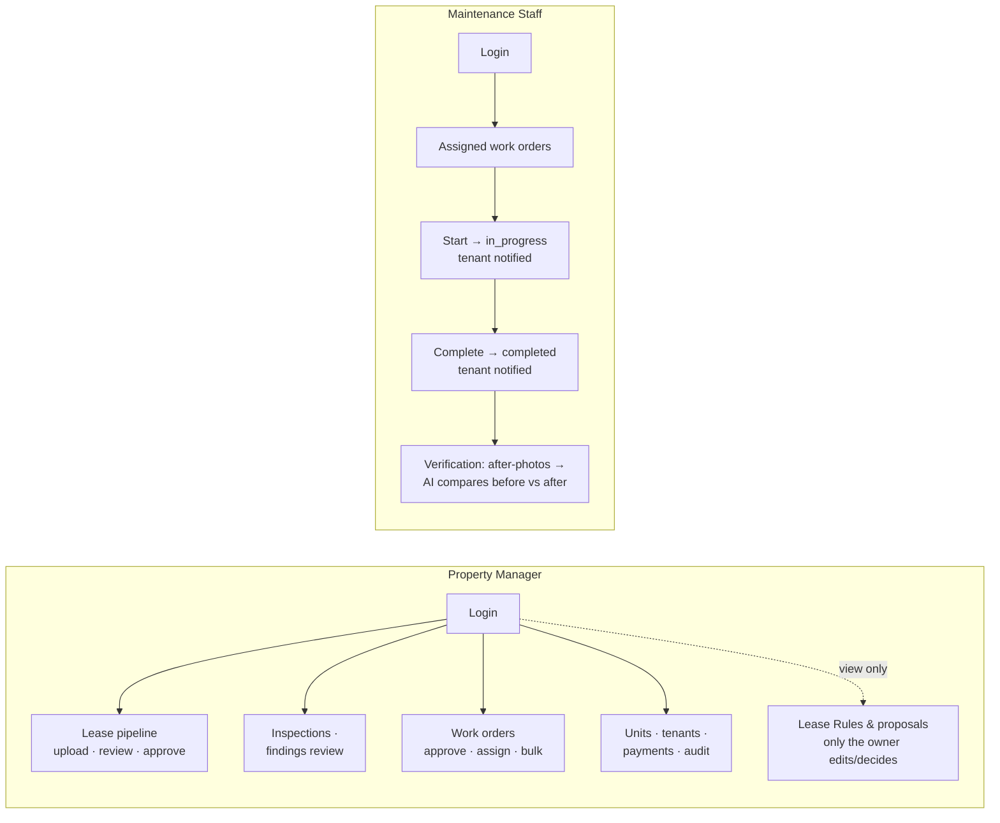

# Staff Workflow — Sridhar Property Intelligence

> Covers two staff roles:
> - **Property Manager** (`property_manager`) — operational management, lease & inspection oversight
> - **Maintenance Staff** (`maintenance_staff`) — executes work orders, runs inspections



---

## Property Manager Workflow

> **Role:** `property_manager`
> **Access Level:** All operations except staff creation/deletion (owner-only)
> **Auth:** `POST /api/v1/users/login/` → Bearer token

---

### 1. Login

```http
POST /api/v1/users/login/
{
  "email": "manager@company.com",
  "password": "SecurePass123"
}
```

---

### 2. Unit Management

```http
GET  /api/v1/units/                             — list all units
GET  /api/v1/units/?occupancy_status=available  — filter available
GET  /api/v1/units/?building=1                  — filter by building
GET  /api/v1/units/{id}/overview/               — unit + lease + work orders
PATCH /api/v1/units/{id}/                       — update details
POST /api/v1/units/{id}/archive/                — archive unit
POST /api/v1/units/{id}/unarchive/              — restore unit
```

---

### 3. Tenant Management

```http
GET  /api/v1/users/tenants/                     — list all active tenants
POST /api/v1/users/tenants/create/              — create tenant + assign unit
POST /api/v1/users/invitations/                 — send invitation email
GET  /api/v1/users/invitations/                 — list invitations
POST /api/v1/users/invitations/{id}/revoke/     — revoke invitation
GET  /api/v1/users/assignments/                 — list all unit assignments
POST /api/v1/users/assignments/{id}/end/        — move tenant out
```

---

### 4. Lease Management

#### Upload and process a lease
```http
POST /api/v1/leases/upload/
Content-Type: multipart/form-data
document: <lease.pdf>

POST /api/v1/leases/{id}/process/               — trigger AI extraction
```

#### Review and correct extracted data
```http
GET  /api/v1/leases/                            — list all leases
GET  /api/v1/leases/{id}/fields/                — see extracted fields
POST /api/v1/lease-fields/{id}/approve/         — approve a field
POST /api/v1/lease-fields/{id}/reject/          — reject a field
POST /api/v1/lease-fields/bulk-approve/         — bulk approve
GET  /api/v1/leases/{id}/flags/                 — see AI flags
POST /api/v1/lease-flags/{id}/review/           — resolve/dismiss flags
GET  /api/v1/leases/{id}/clauses/               — see clauses
GET  /api/v1/leases/{id}/validations/           — see validation rule results (R1–R7 + custom)
POST /api/v1/validations/{id}/override/         — override a failed rule (reason required)
POST /api/v1/leases/{id}/revalidate/            — re-run the current rules on a lease
GET  /api/v1/lease-rules/                       — view the owner's ruleset (read-only; only the owner can edit)
GET  /api/v1/custom-rules/                      — view owner-created custom rules (read-only)
GET  /api/v1/rule-proposals/                    — view rule proposals from policy imports (read-only; only the owner uploads/decides)
PATCH /api/v1/leases/{id}/                      — manually correct fields
POST /api/v1/leases/{id}/resolve-unit/          — link unit to lease
```

#### Approve / Reject lease
```http
POST /api/v1/leases/{id}/approve/
{ "approved_by": "manager@company.com" }

POST /api/v1/leases/{id}/reject/
{ "rejected_by": "manager@company.com", "reason": "Missing signature page" }

POST /api/v1/leases/{id}/cancel/
{ "cancel_reason": "Tenant withdrew", "cancelled_by": "manager@company.com" }
```

---

### 5. Inspections

```http
POST /api/v1/inspections/
{
  "unit": 1,
  "reporter_type": "inspector",
  "description": "Pre-tenancy inspection"
}

POST /api/v1/inspections/{id}/images/           — upload photos
POST /api/v1/inspections/{id}/analyze/          — trigger AI (llava:7b)
GET  /api/v1/inspections/                       — list all inspections
GET  /api/v1/inspections/{id}/                  — inspection detail + findings
PATCH /api/v1/inspections/{id}/                 — update description
POST /api/v1/inspections/{id}/delete/           — soft delete
```

#### Review findings
```http
GET  /api/v1/inspection-findings/?inspection={id}
POST /api/v1/inspection-findings/{id}/review/
{ "review_status": "confirmed", "reviewer": "manager@company.com" }

POST /api/v1/inspection-findings/               — add manual finding
PATCH /api/v1/inspection-findings/{id}/         — edit finding
DELETE /api/v1/inspection-findings/{id}/        — remove finding
```

---

### 6. Work Orders

```http
GET  /api/v1/work-orders/                       — list all work orders
GET  /api/v1/work-orders/?status=draft          — filter by status
GET  /api/v1/work-orders/?unit=1                — filter by unit
POST /api/v1/work-orders/                       — create manual work order
PATCH /api/v1/work-orders/{id}/                 — edit title/description/priority

POST /api/v1/work-orders/{id}/approve/          — approve
POST /api/v1/work-orders/{id}/reject/           — reject
POST /api/v1/work-orders/{id}/assign/           — assign a technician
POST /api/v1/work-orders/{id}/unassign/         — remove the assignment
POST /api/v1/work-orders/{id}/start/            — mark in progress
POST /api/v1/work-orders/{id}/complete/         — mark done
GET  /api/v1/work-orders/{id}/verification/     — before/after photo comparison
DELETE /api/v1/work-orders/{id}/                — delete draft

POST /api/v1/work-orders/bulk-approve/
{ "ids": [1, 2, 3] }
```

---

### 7. Payments, Dashboard & Lease Q&A

```http
GET  /api/v1/payments/                          — all schedule installments (filter by lease/status)
POST /api/v1/payments/{id}/mark-paid/           — record a payment
POST /api/v1/payments/{id}/mark-unpaid/         — undo a recorded payment
GET  /api/v1/dashboard/stats/                   — portfolio stats
GET  /api/v1/dashboard/monthly-stats/           — monthly trends (Reports page)
GET  /api/v1/notifications/                     — notifications feed
POST /api/v1/leases/{id}/ask/                   — AI Q&A over the full lease record
```

---

### 8. Audit Trail

```http
GET /api/v1/audit-events/
GET /api/v1/audit-events/?entity_type=lease
GET /api/v1/audit-events/?entity_type=work_order&entity_id=5
```

---

### Property Manager — Quick Reference

| Module | C | R | U | D | Notes |
|--------|---|---|---|---|-------|
| Unit | ✅ | ✅ | ✅ | ✅ | |
| Tenant | ✅ | ✅ | — | — | invite, end-assignment |
| Lease | upload | ✅ | ✅ | cancel | approve, reject, process |
| LeaseField | — | ✅ | — | — | approve, reject, bulk |
| LeaseClause | ✅ | ✅ | ✅ | ✅ | review |
| LeaseFlag | — | ✅ | — | — | resolve, dismiss |
| Inspection | ✅ | ✅ | ✅ | soft | images, analyze |
| InspectionFinding | ✅ | ✅ | ✅ | ✅ | review |
| WorkOrder | ✅ | ✅ | ✅ | draft | approve, reject, bulk |
| Staff | ❌ | ❌ | ❌ | ❌ | Owner only |

---
---

## Maintenance Staff Workflow

> **Role:** `maintenance_staff`
> **Access Level:** Work orders + inspections only
> **Auth:** `POST /api/v1/users/login/` → Bearer token

---

### 1. Login

```http
POST /api/v1/users/login/
{
  "email": "tech@company.com",
  "password": "SecurePass123"
}
```

---

### 2. View Assigned Work Orders

```http
GET /api/v1/work-orders/
GET /api/v1/work-orders/?status=approved          — ready to start
GET /api/v1/work-orders/?status=in_progress       — currently active
GET /api/v1/work-orders/?priority=urgent          — urgent items
GET /api/v1/work-orders/{id}/                     — detail + unit info
```

---

### 3. Work Order Execution

#### Start a work order
```http
POST /api/v1/work-orders/{id}/start/
```
Status changes: `approved` → `in_progress`

#### Mark complete
```http
POST /api/v1/work-orders/{id}/complete/
```
Status changes: `in_progress` → `completed`

#### Before/after verification
After completing, create a post-repair inspection with after-photos (section 4 below) and analyze it; the comparison is then available on the work order:
```http
GET /api/v1/work-orders/{id}/verification/      — original damage photos vs repair photos, side by side
```

---

### 4. Run an Inspection

Maintenance staff can create and run on-site inspections.

```http
POST /api/v1/inspections/
{
  "unit": 1,
  "reporter_type": "inspector",
  "description": "Post-repair inspection for WO #12"
}
```

#### Upload photos
```http
POST /api/v1/inspections/{id}/images/
Content-Type: multipart/form-data
images: repaired_ac.jpg
images: ceiling_after.jpg
```

#### Trigger AI analysis
```http
POST /api/v1/inspections/{id}/analyze/
```

#### View findings
```http
GET /api/v1/inspection-findings/?inspection={id}
```

---

### 5. View Unit Overview

```http
GET /api/v1/units/{id}/overview/
```

Returns: unit info, active lease summary, recent inspections, all work orders for the unit.

---

### 6. Update Profile & Password

```http
PATCH /api/v1/users/me/
{ "phone": "+974501234567" }

POST /api/v1/users/change-password/
{ "old_password": "old", "new_password": "new" }
```

---

### Maintenance Staff — Quick Reference

| Action | Endpoint | Method |
|--------|----------|--------|
| List work orders | `/work-orders/` | GET |
| Filter by status | `/work-orders/?status=approved` | GET |
| Filter by unit | `/work-orders/?unit={id}` | GET |
| View work order detail | `/work-orders/{id}/` | GET |
| Start work order | `/work-orders/{id}/start/` | POST |
| Complete work order | `/work-orders/{id}/complete/` | POST |
| Create inspection | `/inspections/` | POST |
| Upload photos | `/inspections/{id}/images/` | POST |
| Trigger AI analysis | `/inspections/{id}/analyze/` | POST |
| View findings | `/inspection-findings/?inspection={id}` | GET |
| Unit overview | `/units/{id}/overview/` | GET |
| Update profile | `/users/me/` | PATCH |
| Change password | `/users/change-password/` | POST |

---

## All Roles — Comparison Table

| Capability | Owner | Property Manager | Maintenance Staff | Tenant |
|------------|:-----:|:----------------:|:-----------------:|:------:|
| Create staff | ✅ | ❌ | ❌ | ❌ |
| Manage properties/buildings | ✅ | ✅ | ❌ | ❌ |
| Manage units | ✅ | ✅ | view only | ❌ |
| Create/invite tenants | ✅ | ✅ | ❌ | ❌ |
| Upload & process leases | ✅ | ✅ | ❌ | ❌ |
| Approve/reject leases | ✅ | ✅ | ❌ | ❌ |
| Cancel leases | ✅ | ✅ | ❌ | ❌ |
| Create inspections | ✅ | ✅ | ✅ | via my-info |
| Upload inspection photos | ✅ | ✅ | ✅ | via my-info |
| Trigger AI vision analysis | ✅ | ✅ | ✅ | ❌ |
| Review inspection findings | ✅ | ✅ | view only | ❌ |
| Approve work orders | ✅ | ✅ | ❌ | ❌ |
| Start/complete work orders | ✅ | ✅ | ✅ | ❌ |
| Submit maintenance request | ❌ | ❌ | ❌ | ✅ |
| View own lease/unit | ❌ | ❌ | ❌ | ✅ |
| View audit trail | ✅ | ✅ | ❌ | ❌ |
| Dashboard stats | ✅ | ✅ | ❌ | ❌ |
| Bulk actions | ✅ | ✅ | ❌ | ❌ |
| Delete resources | ✅ | limited | ❌ | ❌ |
