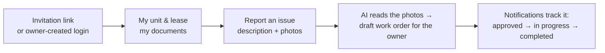

# Tenant Workflow — Sridhar Property Intelligence

> **Role:** `tenant`
> **Access Level:** Self-service only — can only see and act on their own unit
> **Auth:** `POST /api/v1/users/login/` → Bearer token



---

## How a Tenant Gets Access

### Option A — Owner / Manager Creates Account Directly
The owner creates the tenant account and assigns a unit in one step. The tenant receives login credentials.

### Option B — Invitation Link
1. Owner sends an invitation: `POST /api/v1/users/invitations/`
2. Tenant receives an email with a token
3. Tenant accepts the invitation and sets their own password:

```http
POST /api/v1/users/invite/accept/
{
  "token": "<invitation_token>",
  "username": "ali.hassan",
  "password": "MyPassword123"
}
```

Response includes JWT tokens — tenant is now logged in.

---

## 1. Login

```http
POST /api/v1/users/login/
{
  "email": "tenant@email.com",
  "password": "MyPassword123"
}
```

Response:
```json
{
  "access": "<jwt_access_token>",
  "refresh": "<jwt_refresh_token>",
  "user": {
    "id": 5,
    "email": "tenant@email.com",
    "role": "tenant"
  }
}
```

---

## 2. View My Unit & Lease

```http
GET /api/v1/users/my-info/
Authorization: Bearer <access_token>
```

Response includes:
```json
{
  "assignment": {
    "unit_label": "Unit 301",
    "unit_type": "apartment",
    "area_sqm": 95.5,
    "floor_number": 3,
    "parking_bay": "P-12",
    "building_name": "Tower A",
    "move_in_date": "2026-01-01"
  },
  "leases": [
    {
      "id": 1,
      "tenant_name": "Ali Hassan",
      "start_date": "2026-01-01",
      "end_date": "2026-12-31",
      "rent_amount": 5500.00,
      "currency": "QAR",
      "document": "http://localhost:8000/media/leases/documents/lease.pdf",
      "approval_status": "approved"
    }
  ],
  "work_orders": [...]
}
```

---

## 3. Submit a Maintenance Request

### Text-only request
```http
POST /api/v1/users/my-info/
Authorization: Bearer <access_token>
Content-Type: application/json

{
  "title": "AC not working in bedroom",
  "description": "The AC stopped cooling since yesterday evening. Room temperature is very high.",
  "priority": "high"
}
```

### With photos (recommended)
```http
POST /api/v1/users/my-info/
Authorization: Bearer <access_token>
Content-Type: multipart/form-data

title: Broken tap in bathroom
description: Hot water tap is leaking constantly
priority: medium
images: bathroom_tap.jpg
images: under_sink.jpg
```

What happens automatically:
1. A **Work Order** is created with status `pending_approval`
2. If photos are uploaded → an **Inspection** is created with the images
3. AI (llava:7b) analyzes the photos and generates **Inspection Findings**
4. Owner / Property Manager reviews and approves the work order
5. Maintenance staff is assigned and completes the work

### Priority values
| Priority | Use For |
|----------|---------|
| `low` | Non-urgent cosmetic issues |
| `medium` | Normal repairs |
| `high` | Significant disruption |
| `urgent` | Safety, water, power, security |

---

## 4. View My Work Orders

Work orders are included in the `GET /api/v1/users/my-info/` response under `work_orders`.

Work Order Status Flow (visible to tenant):
```
pending_approval  →  approved  →  in_progress  →  completed
                 ↘  rejected
```

---

## 5. View & Download Lease Document

The lease document URL is returned in the `my-info` response:
```json
"document": "http://localhost:8000/media/leases/documents/lease_001.pdf"
```

The tenant can open or download the PDF directly from that URL.

---

## 6. Notifications

```http
GET  /api/v1/notifications/
POST /api/v1/notifications/{id}/mark_read/
POST /api/v1/notifications/mark_all_read/
```

Tenants receive notifications about their own unit only:
- **Lease Approved** — their lease was approved (links to `/tenant/documents`)
- **Maintenance Update** — a work order on their unit was approved, started, or completed (links to `/tenant/maintenance`)

---

## 7. Update Profile

```http
PATCH /api/v1/users/me/
Authorization: Bearer <access_token>
{
  "phone": "+974501234567"
}
```

---

## 8. Change Password

```http
POST /api/v1/users/change-password/
Authorization: Bearer <access_token>
{
  "old_password": "MyPassword123",
  "new_password": "NewSecurePass456"
}
```

---

## 9. Refresh Token

```http
POST /api/v1/users/token/refresh/
{
  "refresh": "<refresh_token>"
}
```

---

## 10. Logout

```http
POST /api/v1/users/logout/
Authorization: Bearer <access_token>
{
  "refresh": "<refresh_token>"
}
```

---

## Tenant — Quick Reference Summary

| Action | Endpoint | Method |
|--------|----------|--------|
| Login | `/users/login/` | POST |
| Accept invitation | `/users/invite/accept/` | POST |
| View my unit + lease + work orders | `/users/my-info/` | GET |
| Submit maintenance request | `/users/my-info/` | POST |
| Submit with photos | `/users/my-info/` | POST (multipart) |
| View notifications | `/notifications/` | GET |
| Mark notification read | `/notifications/{id}/mark_read/` | POST |
| Update profile | `/users/me/` | PATCH |
| Change password | `/users/change-password/` | POST |
| Refresh token | `/users/token/refresh/` | POST |
| Logout | `/users/logout/` | POST |

---

## Tenant Frontend Pages

| Page | What It Shows |
|------|---------------|
| `/tenant` | Dashboard — unit info, active lease, recent work orders |
| `/tenant/maintenance` | Submit new request + view all requests |
| `/tenant/documents` | View and download lease document |
| `/tenant/notifications` | Lease approvals and maintenance updates for the tenant's unit |
| `/tenant/profile` | Edit name, phone, change password |
